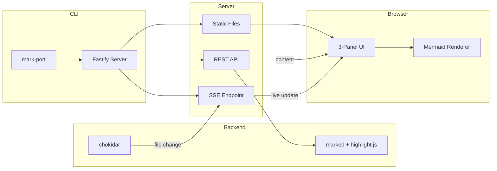
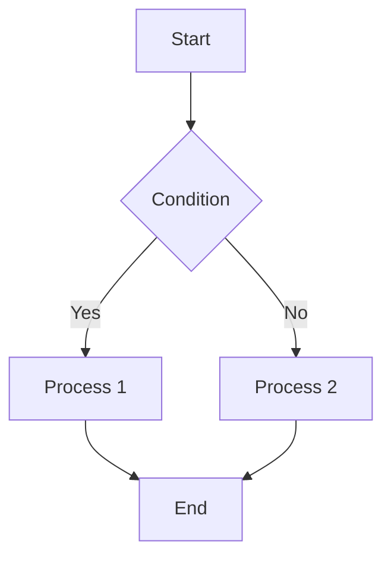
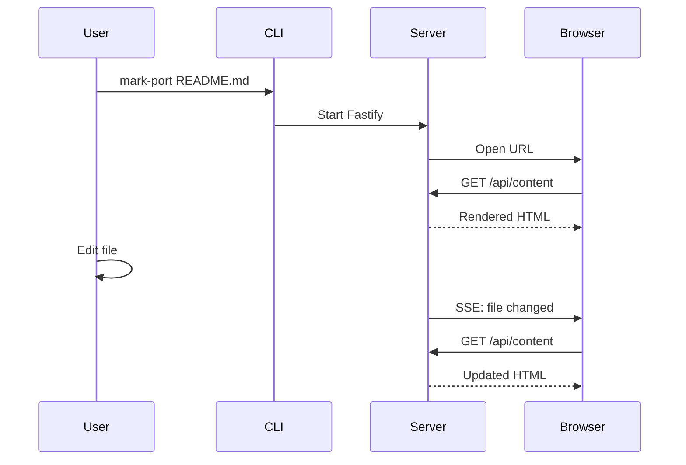

# mark-port

A real-time Markdown preview CLI tool.

Simple and fast Markdown previewer that automatically refreshes the browser when you edit files.

## Features

- **Live Reload** - Automatically refreshes browser on file save (SSE)
- **3-Panel UI** - File tree / Preview / Table of contents
- **Syntax Highlighting** - Auto language detection with highlight.js
- **Mermaid Support** - Diagrams and flowcharts
- **GitHub-style** - Familiar Markdown rendering
- **Fast** - Lightweight Fastify-based server

## Architecture



## Installation

```bash
npm install -g mark-port
```

## Usage

### Preview a single file

```bash
mark-port README.md
```

### Preview all Markdown files in a directory

```bash
mark-port ./docs
```

### Preview current directory

```bash
mark-port
```

## Options

| Option | Description | Default |
|--------|-------------|---------|
| `-p, --port <number>` | Server port number | `3000` |
| `--no-open` | Disable automatic browser opening | - |
| `--no-watch` | Disable file watching | - |
| `-V, --version` | Show version | - |
| `-h, --help` | Show help | - |

### Examples

```bash
# Start on port 8080
mark-port ./docs --port 8080

# Don't open browser automatically
mark-port README.md --no-open

# Start without file watching
mark-port ./docs --no-watch
```

## UI

```
┌─────────────┬──────────────────────────────┬─────────────┐
│             │                              │             │
│    File     │          Preview             │     TOC     │
│    Tree     │                              │             │
│             │                              │             │
│  📁 docs    │  # Title                     │  · Title    │
│    📄 a.md  │                              │  · Section  │
│    📄 b.md  │  Content...                  │             │
│             │                              │             │
└─────────────┴──────────────────────────────┴─────────────┘
```

- **Left Panel**: Markdown file tree
- **Center Panel**: Rendered Markdown
- **Right Panel**: Table of contents with headings (click to scroll)

## Supported Formats

### Markdown

- Headings (H1-H6)
- Bold, italic, strikethrough
- Links and images
- Lists (ordered and unordered)
- Code blocks (with syntax highlighting)
- Tables
- Blockquotes
- Horizontal rules

### Mermaid Diagrams

Flowcharts, sequence diagrams, and more are supported:





## Development

### Setup

```bash
git clone https://github.com/satomi-1224/mark-port.git
cd mark-port
pnpm install
```

### Commands

```bash
# Build
pnpm run build

# Development mode (watch)
pnpm run dev

# Run tests
pnpm run test

# Type check
pnpm run typecheck
```

### Project Structure

```
mark-port/
├── bin/
│   └── mark-port.js        # CLI entry point
├── src/
│   ├── cli.ts              # CLI logic
│   ├── server.ts           # Fastify server
│   ├── markdown.ts         # Markdown parser
│   ├── fileTree.ts         # File tree builder
│   ├── watcher.ts          # File watcher
│   ├── types.ts            # Type definitions
│   └── routes/
│       ├── api.ts          # REST API
│       └── sse.ts          # Server-Sent Events
├── public/
│   ├── index.html          # Frontend HTML
│   ├── styles.css          # Styles
│   └── app.js              # Frontend JS
└── dist/                   # Build output
```

## Tech Stack

| Component | Technology |
|-----------|------------|
| Server | Fastify |
| Markdown Parser | marked |
| Syntax Highlighting | highlight.js |
| Diagrams | Mermaid |
| File Watching | chokidar |
| CLI | Commander.js |
| Build | tsup |
| Testing | Vitest |

## License

MIT
